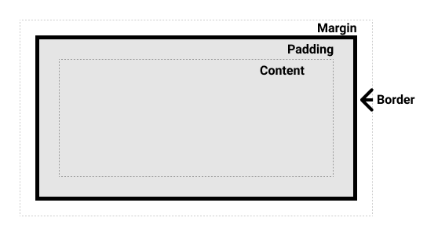

# 1. Intro to HTML & CSS

## Overview

Three pillars of web development

- HTML -> scaffolding & structure
  - semantic markup - the importance of structure (giving meaning) vs presentation
  - **important/essential for accessibility**
- CSS -> styles & appearance
- JavaScript/TypeScript -> interactivity (+ more!)

---

## HTML

- HTML syntax - opening & closing tags `<xxx> </xxx>`
- head - metadata for the page
  - `<title>`
  -`<link>`
- body - elements actually rendered on the page
  - headings -`<h1>`,`<h2>`,`<h3>`, etc
  -`
`,``
  -`<b>` vs`<strong>` (presentation vs meaning)
  -`<i>` vs`<em>`
  -` ` &`
` (note: self-closing)
  -`<a>` - anchor element 
    - used for navigation within a page (using `#id`) or to another page/URL 
  -`<button>`
    - used for interactivity/triggering on-click events
  -`<ul>`/`<ol>` &`<li>`
  -``
  -`
` <- **core building block**
     -`<main>`,`<section>`,`<nav>`,`<header>`,`<footer>`

---

## CSS

- how to use
  - inline style attribute on HTML element
  - `<style>` element in HTML `<head>`
  - separate css files (imported with `<link>` element in `<head>`)

- **syntax** - `[selector] { [property]:[value]; }`
- inheritance - e.g. inheriting properties from parents

- CSS selectors
  - element e.g. `body` or `p`
  - id - with `#` hashtag, e.g. `#test-id`
  - class - with leading `.`, e.g. `.class`

- specificity - highest specificity selector will "win"
  - e.g. inline style > id > class > element
- **the box model** - div as a box:
  

- hex & rgb colors
  - rbg - red/green/blue from `0` to `255` -> `rgb(64, 224, 208)`
  - hex - using hexidecimal numbering to represent the same info as rgb 
    - `0`->`00` & `255`-> `ff` 
    - e.g. `#40e0d0` -> `red:#40, green:#e0, blue:#d0` -> `rgb(64, 224, 208)`
- basic properties
  - background & background-color
  - color
  - border
    - border-radius
  - margin
  - padding
  - opacity
  - width & height
    - absolute `px` vs relative `%` units
  - font
    - family
    - size
    - weight
    - line-height
    - style - e.g. `italic`
- cascading selectors/combinators e.g. `.heading .title`
  - parent & child relationship
  - descendent
  - child e.g. `>`
- display
  - block, inline-block, & **none**
- `!important` -> overrides specificity (use _very_ sparingly)
